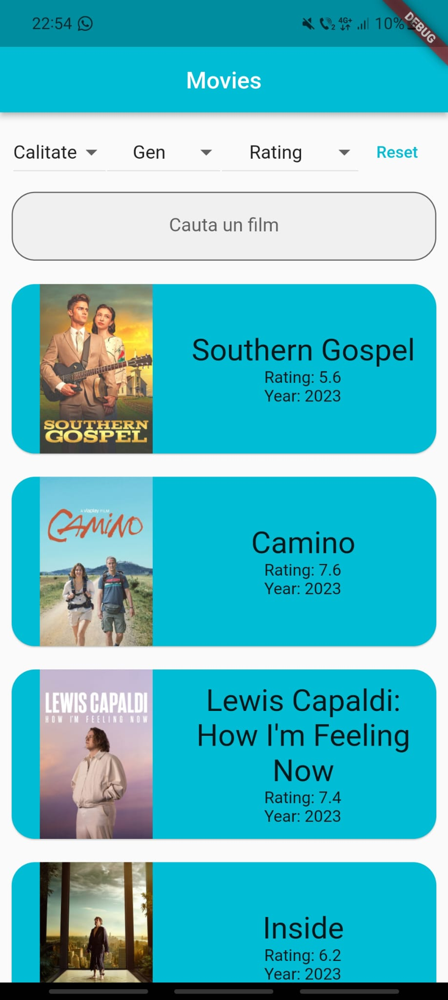
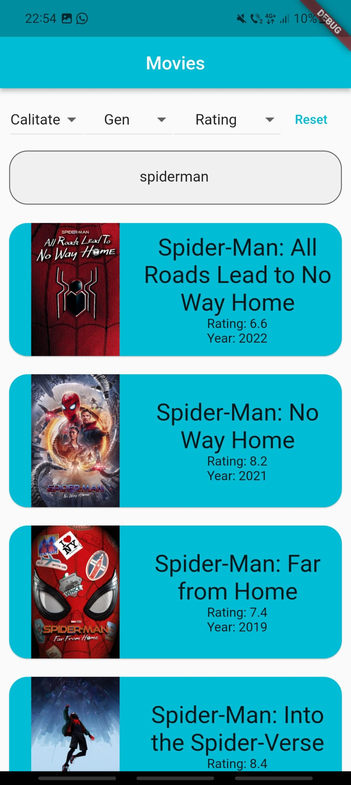
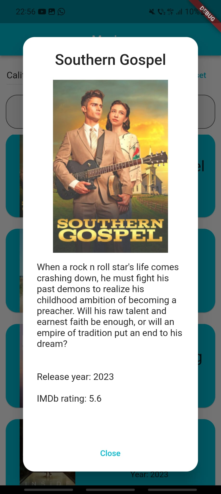

## Movies

In this project I developed a mobile application where users can search, see summaries and photos and filter movies by
genre, rating or quality. I used Flutter and Dart, two API endpoints and Redux for state
management. The main page is an infinite-scroll list of movies. On tapping a movie a pop-up with a larger image and a
summary appears.

